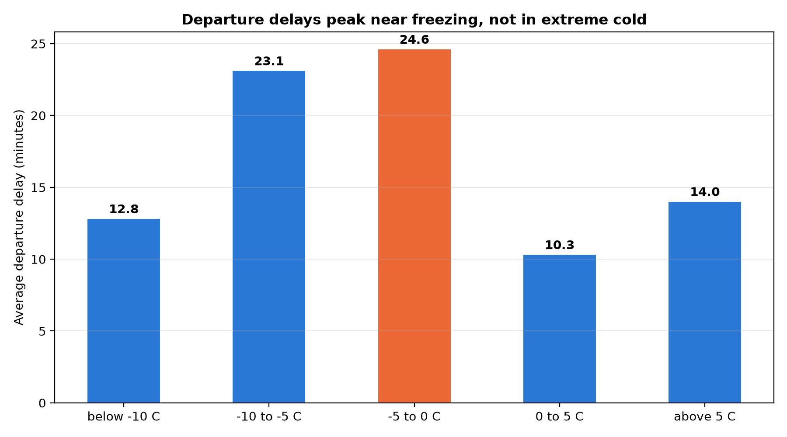

# Flight Delays and Weather

**Does cold weather delay flights?**

A dbt project that combines US flight data with historical weather data to answer
one question. The short answer: it is not the cold. It is the temperature around
the freezing point.



## The finding

Every flight was matched to the weather at its origin airport, in the hour it was
scheduled to depart, and then grouped into temperature bands.

| Temperature at departure | Flights | Avg. departure delay | Delayed > 15 min |
|---|---|---|---|
| below -10 °C | 455 | 12.8 min | 18.2% |
| -10 to -5 °C | 1,559 | 23.1 min | 25.8% |
| **-5 to 0 °C** | **1,429** | **24.6 min** | **35.1%** |
| 0 to 5 °C | 2,408 | 10.3 min | 19.0% |
| above 5 °C | 26,009 | 14.0 min | 21.1% |

- The **coldest** band is not the worst: 12.8 minutes, close to a normal day.
- The peak is **just below freezing**: 24.6 minutes, and more than one in three
  flights leaves at least 15 minutes late.
- **Right above zero** the delays disappear: 10.3 minutes, the lowest value here.
- Above 5 °C is the baseline: 14 minutes, the everyday delay level of the system.

The shape is a peak, not a slope. Around zero degrees, water is still liquid when
it hits the aircraft and then freezes on the surface, which means de-icing before
departure. In much colder air the snow is dry and easier to handle, and above zero
there is nothing to freeze.

**So what:** an airport planning for winter should not plan around how cold it
gets, but around how many hours it spends near the freezing point.

## Data

| Source | Content |
|---|---|
| US flight data | One row per flight: schedule, actual times, delays, cancellations, origin and destination |
| [Meteostat](https://dev.meteostat.net/) | Hourly and daily weather per airport: temperature, precipitation, snow, wind, condition codes |
| Airport reference data | Airport code, name, city, country, coordinates, UTC offset |

Period: January 2026. Weather data is available for a subset of the airports.

## Project structure

```
models/
├── staging/    raw sources, JSON flattened into columns
├── prep/       cleaning, data types, date parts and seasons
└── mart/       one model per business question
```

Key models:

- `prep_flights` — flight times as `TIME`, durations as `INTERVAL`, distance in km
- `prep_weather_hourly` — one row per airport and hour
- `mart_delay_by_temperature` — the model behind the chart: flights joined to the
  weather of their scheduled departure hour, grouped into temperature bands
- `mart_faa_stats`, `mart_route_stats`, `mart_weather_weekly` — descriptive stats
  per airport, per route and per week

## How to run

**1. The data models**

```bash
dbt run
dbt test
```

**2. The chart**

```bash
pip install sqlalchemy psycopg2-binary pandas matplotlib python-dotenv
python reporting/plot_simple.py
```

The script reads `mart_delay_by_temperature` with SQLAlchemy and writes
`images/delay_by_temperature.png`.

Database credentials come from a `.env` file in the project root (not committed):

```
POSTGRES_USER=...
POSTGRES_PASS=...
POSTGRES_HOST=...
POSTGRES_PORT=5432
POSTGRES_DB=...
POSTGRES_SCHEMA=...
```

## Tests

Generic tests (`unique`, `not_null`) are defined next to the models in the `.yml`
files. Singular tests live in `tests/` and check that no temperature band has a
negative average delay or too few flights to be reliable.